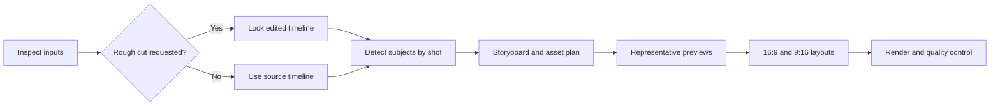

# Animated Video Workflow

[简体中文](README.zh-CN.md)

An installable Agent Skill for turning presenter videos, voiceovers, subtitles, or scripts into mixed live-action and animated videos. It coordinates input inspection, optional rough cuts, subject-aware layout, storyboards, asset planning, engine routing, multi-aspect rendering, and quality control.

The default workflow is semi-automatic: the agent pauses at the storyboard, asset re-planning, and representative-preview stages. Full automation is available when explicitly requested.

## Easiest installation (recommended)

No terminal knowledge is required. Copy the entire message below into Codex, Claude Code, Cursor, OpenCode, or another agent that can install Agent Skills:

```text
Please install this Agent Skill and verify that it is available after installation:
https://github.com/mrsanguo/animated-video-workflow

The installable Skill is located at skills/animated-video-workflow. Prefer your agent's native Skill installer. If none is available, use the compatible method documented below to install it into the user-level/global Skills directory. Then tell me where it was installed and whether the agent needs to be restarted.
```

The agent should handle downloading, path selection, installation, and verification. The details below are primarily for agents or troubleshooting.

## Highlights

- Accepts presenter video, audio, SRT, or scripts as equal core inputs.
- Keeps live footage where it adds trust, then introduces animation, screenshots, charts, images, and video assets where they improve understanding.
- Detects faces and people by shot, estimates a motion envelope, and generates protected subject regions for overlays.
- Handles picture-in-picture, landscape presenter, full-frame presenter, portrait presenter, and multi-person layouts.
- Searches for images, videos, and screenshots before generating missing visual assets.
- Routes scenes between source footage, HyperFrames, Remotion, and FFmpeg according to available tools and project needs.
- Builds separate 16:9 and 9:16 layouts instead of applying a blind center crop.
- Records external asset provenance and leaves final copyright approval to the user.

## Installation details (usually not needed by users)

### Open agent ecosystem

The [`skills`](https://github.com/vercel-labs/skills) CLI supports Codex, Claude Code, Cursor, OpenCode, and many other agents:

```bash
npx skills add mrsanguo/animated-video-workflow --skill animated-video-workflow -g
```

Use `--agent codex`, `--agent claude-code`, or another supported agent name to target a specific tool. Remove `-g` to install only in the current project.

### Codex skill installer

Ask Codex:

```text
$skill-installer install https://github.com/mrsanguo/animated-video-workflow/tree/main/skills/animated-video-workflow
```

Restart the agent after installation if it does not discover the Skill immediately.

### Manual installation

Clone the repository and copy `skills/animated-video-workflow` into the skills directory used by your agent. The directory must remain intact and contain `SKILL.md`, `scripts/`, and `references/`.

## Example prompts

```text
Use animated-video-workflow to package this presenter video with animation.
Detect the speaker first, propose the storyboard and representative previews, then wait for confirmation.
Create both 16:9 and 9:16 versions.
```

```text
Use animated-video-workflow in full-auto mode with this voiceover and SRT.
Find suitable images, videos, or screenshots, generate only missing assets, and deliver both aspect ratios.
```

```text
Rough-cut this video first, then use animated-video-workflow for animation packaging.
```

## Workflow



The Skill writes explicit manifests and plans before rendering. A typical project includes `project-manifest.json`, `subject-layout.json`, `storyboard.json`, `asset-plan.json`, `asset-register.json`, `render-plan.json`, and `qc-report.json`.

## Requirements

- Python 3.10 or newer.
- FFmpeg and ffprobe available on `PATH` for media probing and final assembly.
- OpenCV 4.x for subject detection:

  ```bash
  python -m pip install -r skills/animated-video-workflow/scripts/requirements-subject.txt
  ```

- HyperFrames and/or Remotion are optional. The workflow uses them only when their local dependencies and guidance are available; otherwise it can route eligible work to FFmpeg.
- Network access is required only for external asset search, capture, AI generation, or dependency installation.

The implementation has been exercised primarily on Windows. The Python analysis scripts are cross-platform, while shell commands and engine setup may need normal platform-specific adaptation.

## Subject detection scope

Subject tracking is shot-level and sample-based, not frame-by-frame rotoscoping. It is designed to keep overlays away from common talking-head and picture-in-picture subjects without causing the animation panel to jitter. Low-confidence, unknown, and multi-person shots are marked for review or routed to conservative layouts.

## Safety and copyright

- Original media is never overwritten.
- Searched and captured assets are recorded with source metadata and `pending-review` copyright status.
- The Skill does not claim that an unknown online asset is commercially cleared.
- Users remain responsible for final rights review and for verifying generated factual visuals.

## Development

Run the tests with:

```bash
python -m unittest discover -s tests -p "test_*.py" -v
```

The current suite covers input inspection, plan validation, subject-layout logic, and output verification. See the installable instructions in [`skills/animated-video-workflow/SKILL.md`](skills/animated-video-workflow/SKILL.md).

## License

MIT. See [LICENSE](LICENSE).

