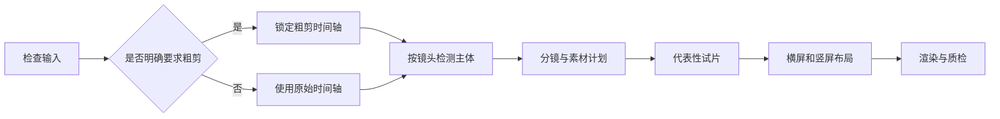

# 动画视频总控 Skill

[English](README.md)

这是一个可直接安装的 Agent Skill，用于把真人口播视频、配音、字幕或文稿制作成“真人 + 动画 + 截图 + 图表 + 图片/视频素材”的混合型视频。它负责编排输入检查、可选粗剪、人物避让构图、动画分镜、素材计划、引擎选择、横竖屏适配和成片质检。

默认采用半自动模式：在分镜与素材方案、素材重规划、代表性试片三个节点等待确认。用户明确要求全自动时，才连续执行。

## 核心能力

- 真人视频、音频、SRT 和文稿都可以作为核心输入。
- 保留有信任感的真人段落，在重点信息处切入动画、截图、图表、图片或视频素材。
- 按镜头检测人脸和人物，计算活动范围，并生成动画不可遮挡的主体安全区。
- 识别圆窗画中画、横屏真人、全屏真人、竖屏真人和多人画面。
- 优先使用用户素材，再搜索图片、视频或截图，最后才生成缺失视觉素材。
- 根据项目和本机能力，在原视频、HyperFrames、Remotion 与 FFmpeg 之间选择引擎。
- 分别设计 16:9 与 9:16 构图，不做简单居中裁切。
- 登记外部素材来源，由用户完成最终版权审核。

## 安装

### 多种 Agent 通用安装

[`skills`](https://github.com/vercel-labs/skills) CLI 支持 Codex、Claude Code、Cursor、OpenCode 等多种 Agent：

```bash
npx skills add mrsanguo/animated-video-workflow --skill animated-video-workflow -g
```

可以通过 `--agent codex`、`--agent claude-code` 等参数指定 Agent。删除 `-g` 则只安装到当前项目。

### Codex 安装

直接对 Codex 说：

```text
$skill-installer install https://github.com/mrsanguo/animated-video-workflow/tree/main/skills/animated-video-workflow
```

如果安装后没有立即出现，重启一次 Agent。

### 手动安装

克隆仓库，然后把 `skills/animated-video-workflow` 整个目录复制到目标 Agent 的 Skills 目录。必须保留其中的 `SKILL.md`、`scripts/` 和 `references/`。

## 使用示例

```text
使用 animated-video-workflow 给这个真人口播视频做动画包装。
先识别人物并输出分镜和代表性试片，等我确认后再渲染，同时制作横屏和竖屏版本。
```

```text
使用 animated-video-workflow 全自动处理这段配音和 SRT。
自动寻找图片、视频或截图，只生成缺失素材，最后输出 16:9 和 9:16 两个版本。
```

```text
先把这个视频粗剪，再使用 animated-video-workflow 进行动画包装。
```

## 工作流程



Skill 会先生成可检查的清单和计划，再进入渲染。典型项目包含 `project-manifest.json`、`subject-layout.json`、`storyboard.json`、`asset-plan.json`、`asset-register.json`、`render-plan.json` 和 `qc-report.json`。

## 运行要求

- Python 3.10 或更高版本。
- FFmpeg 和 ffprobe 已加入 `PATH`，用于媒体检查和最终合成。
- 人物检测需要 OpenCV 4.x：

  ```bash
  python -m pip install -r skills/animated-video-workflow/scripts/requirements-subject.txt
  ```

- HyperFrames 和 Remotion 为可选引擎。只有本机存在相应依赖和使用规范时才会调用；否则可以把适合的任务路由给 FFmpeg。
- 只有搜索外部素材、网页截图、AI 生成或安装依赖时需要网络。

目前主要在 Windows 环境完成验证。Python 分析脚本可以跨平台运行，命令行和渲染引擎安装需按操作系统正常调整。

## 人物检测边界

当前采用“镜头级采样跟踪”，不是逐帧抠像。它适合让动画避开常见口播人物和圆窗，同时避免动画面板跟随检测框左右抖动。低置信度、未知构图和多人画面会要求确认，或采用更保守的包装方案。

## 安全与版权

- 不覆盖原始媒体。
- 搜索或截图素材会登记来源，并标记为 `pending-review`。
- 不会把来源不明的网络素材声称为可商用。
- 用户负责最终版权审核，以及事实性生成画面的准确性检查。

## 开发验证

运行测试：

```bash
python -m unittest discover -s tests -p "test_*.py" -v
```

当前测试覆盖输入检查、计划校验、主体布局逻辑和输出验证。可安装的 Agent 指令位于 [`skills/animated-video-workflow/SKILL.md`](skills/animated-video-workflow/SKILL.md)。

## 许可证

MIT，详见 [LICENSE](LICENSE)。
